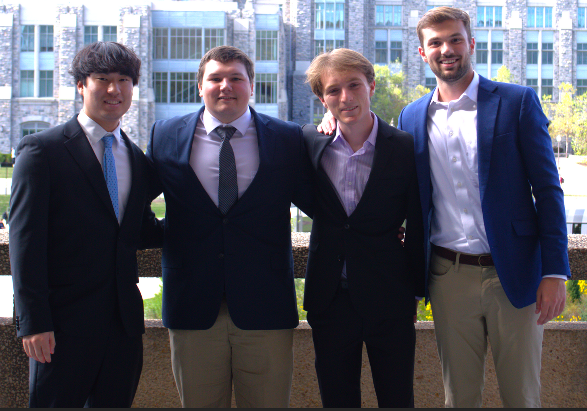

F25-04: Drive Secure Teaching Automotive Cybersecurity with RAMN
=======================================

This GitHub lays out the fundamentals for automotive cybersecurity utilizing RAMN.

To view the cybersecurity challenges, view the `Challenges folder <https://github.com/JonasvonStein/F25-04-Drive-Secure-Teaching-Automotive-Cybersecurity-with-RAMN/tree/main/Challenges>`_

To access the hints to each challenge access `hints <https://github.com/JonasvonStein/F25-04-Drive-Secure-Teaching-Automotive-Cybersecurity-with-RAMN/tree/main/docs/challengeHints>`_

To access our other documentation about CAN, UDS, RAMN, CARLA click `here <https://github.com/JonasvonStein/F25-04-Drive-Secure-Teaching-Automotive-Cybersecurity-with-RAMN/tree/main/Documentation>`_

Visit our Website `here <https://f25-04-drive-secure-teaching-automotive-cybersecurity-with-ramn.readthedocs.io/en/latest/index.html>`_

Left to Right: William Min, Colton Smith, Jonas von Stein, Brooks O'Hanlan
